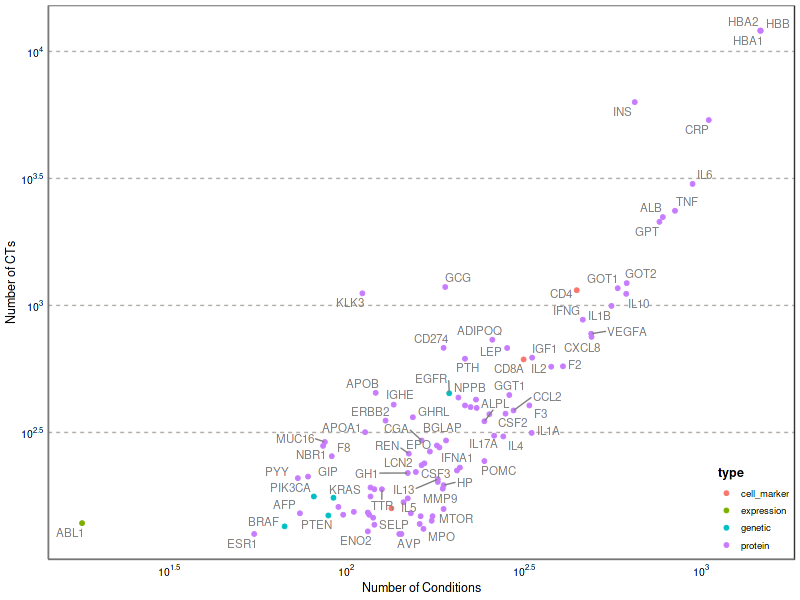

# Introduction

In these last two decades, biomarkers have gained prominence in drug discovery, development, and approval processes [@Gromova2020]. Biomarkers may also provide insights on disease prognosis, progression, and may be used to monitor the efficacy and safety of the therapy. Biomarkers may be simple molecules such as metabolites (blood lactate levels following exercise), carbohydrates (glucose for diabetes mellitus or galactomannan, used to diagnose invasive aspergillosis infections in humans), or peptides, and proteins (such as insulin, hemoglobin, prostate-specific antigen, and C-reactive protein). Biomarkers also include cells, histological data, and genetic markers. Genetic markers encompass single genes, small collections of three or four genes, and large collections (arrays) of genes (For example the pam50 signature for breast cancer [@Bernard2009]. Genetic markers include classical mRNA, as well as micro-RNA (miRNA). More complex biomarkers are cells such as platelets, particles such as low-density lipoprotein (LDL) cholesterol for assessing risk for atherosclerosis, histological data, T cells, and autoantibodies, or even physiological variables, such as blood pressure.  

Typically, biomarkers can be measured in the blood or other biological fluids. Nevertheless, more recently, the detection of alterations in the mRNA levels of genes, or their methylation level, or the presence of SNPs have emerged as new types of biomarkers [@Sinnott2021;@Sorokin2020;@miura_serum_2008;@Bock2016].   
Biomarkers are key measurements of outcomes both in basic research and clinical studies, and are frequently used in clinical studies [@Strimbu2010] as “surrogate endpoints”. A surrogate endpoint is a biomarker that is intended to serve as a substitute for a clinically meaningful endpoint and is expected to predict the effect of a therapeutic intervention. While numerous laboratory biomarkers may be associated with a particular disease state, the term ‘surrogate’ indicates the ability of a biomarker to provide information about the clinical prognosis or efficacy of a therapy.   
The [Clinical Trials database](https://clinicaltrials.gov/) (CT.gov from now on) is a rich source of information about the use of biomarkers in clinical studies. The case for using text mining to standardize and normalize the information in clinical trials is particularly compelling as the industry looks to cut the costs and time required for trials. Text mining approaches may assist in the identification of the biomarkers used in a therapeutic area or a specific disease, discover biomarkers trends across all the clinical studies recorded at CT.gov, or assess the specificity of a biomarker, among other applications.   
In this contribution, we present the results of text mining CT.gov records to identify and standardize information about disease biomarkers. For this, we have developed a pipeline to identify biomarkers mentioned in different sections of a clinical trial record and classify them into different categories. We have created a corpus of CT.gov records annotated with different biomarker types, which was used to train a machine learning model that classifies biomarkers according to the following categories: (1) protein biomarkers, which encompasses proteins that are measured in blood, or other biological fluids, or that have been detected using immunohistochemistry, (2)  genetic biomarkers, which includes genes that contain polymorphisms, copy number alterations, or chromosomal abnormalities, (3) phosphobiomarkers, that include abnormal protein phosphorylation, (4) epigenetic biomarkers, that undergo changes in DNA methylation patterns, and (5) expression biomarkers, which are genes that are measured as mRNA, and non-coding RNA such as microRNAs, and (6) cell markers, mainly composed of cell surface antigens.  


# Methods

We downloaded the Clinical trials data from the [Clinical Trials Transformation Initiative] (https://aact.ctti-clinicaltrials.org/download), on December 17, 2021. We performed named entity recognition to detect mentions of genes in the outcomes, outcome measurements, and design outcomes  sections of the Clinical Trials.  

Clinical trials provide the name of the conditions investigated in the trial. Conditions are the diseases, disorders, syndromes, illnesss, or injuries being studied, that are annotated using an NLM algorithm [@Tasneem2012]. We used the conditions annotated by the algorithm, and we normalized the names provided in the files to MeSH identifiers using the UMLS Metathesaurus [@Bodenreider2004].

We used the [DISGENET plus](https://beta.disgenetplus.com/) text mining tool [@Pinero2019] that improves the detection and normalization of mentions of genes by relying on deep learning models complemented by an extensive set of custom heuristics, and by integrating analysis modules to consistently detect and characterize distinctive linguistic traits of biomedical texts like the use of acronyms.  

We then selected 1,000 examples of the sentences with mentions of biomarkers, and classified them into 6 different categories:  (1) protein biomarkers, which encompasses proteins that are measured in blood, or other biological fluids, or that have been detected using immunohistochemistry, (2)  genetic biomarkers, which includes genes that contain polymorphisms, copy number alterations, or chromosomal abnormalities, (3) phosphobiomarkers, that include abnormal protein phosphorylation, (4) epigenetic biomarkers, that undergo changes in DNA methylation patterns, and (5) expression biomarkers, which are genes that are measured as mRNA, and non-coding RNA such as microRNAs, and (6) cell markers, mainly composed of cell surface antigens.  We used this corpus to train a random forest classifier to then assign the biomarker types to the rest of the data. We use the rpart package, via the library [tidymodels](https://www.tidymodels.org/) in R. We performed hyperparameter tuning for the number of tokens, and for the number of trees, number of members, and number of features (mtry). We provide more details of the implementation, along with a sample of the developed corpus in [this github repositoy](https://github.com/jpinero/biomarkers).


# Results
In Figure 1 we show a general scheme of the pipeline. 

```{r, echo=FALSE, out.width="100%",  fig.cap = 'Figure 1: The Pipeline.'}
knitr::include_graphics("images/Figures_summary.png")
```

Using this pipeline, we have processed 398,516 clinical studies available at CT.gov, carried out between 1999 and 2021. We found over 43,000 clinical studies measuring 3,100 biomarkers for 2,600 diseases. The clinical trial have been carried out between 1999 and 2021. Figure 2 shows the trends in the use of biomarker across all therapeutic areas in these 20 years. [Here](Conditions.html) is a selection of the top 100 conditions by number of clinical trials in the dataset.

```{r, echo=FALSE, out.width="100%",  fig.cap = 'Figure 2: Clinical Trials containing biomarkers by therapeutic area per year.'}
knitr::include_graphics("images/Figure_therapeutic_area_conditions.png")
```

Figure 3 shows the number of biomarkers  across all therapeutic areas in these 20 years. [Here](Biomarkers.html) is a selection of the top 100 biomarkers by number of clinical trials in the dataset. 

```{r, echo=FALSE, out.width="100%",  fig.cap = 'Figure 2: Number of biomarkers assessed in Clinical Trials by therapeutic area per year.'}
knitr::include_graphics("images/Figure_therapeutic_area_number_of_genes.png")
```


Seventy-six percent of the biomarkers are measured at protein level, 45% at expression level, 30% are genetic biomarkers, 11% are cell markers, 5% are phosphobiomarkers, and 4% are epigenetic (methylation) (Figure 4). 

```{r, echo=FALSE,  fig.cap = 'Figure 4: Biomarker types.', fig.width=6, message=FALSE, warning=FALSE}
library(ggplot2)
library(plotly)

dat <- readRDS("data/data_for_plots.rds")
 

library(ggpubr)

p<- ggdotchart(dat, x = "Biomarker Type", y = "percent",
           color = "Biomarker Type",                                # Color by groups
        #   palette = c("#00AFBB", "#E7B800", "#FC4E07"), # Custom color palette
           sorting = "ascending",                        # Sort value in descending order
           add = "segments",                             # Add segments from y = 0 to dots
            rotate = TRUE,                                # Rotate vertically
           group = "Biomarker Type",                                # Order by groups
           dot.size = 10,                                 # Large dot size
           label = dat$n,                        # Add mpg values as dot labels
           font.label = list(color = "white", size = 8, 
                             vjust = 0.5),               # Adjust label parameters
           ggtheme = theme_pubr()                        # ggplot2 theme
           ) +theme(legend.position="none")

plotly::ggplotly(p)


```

The most common biomarkers measured at protein level are hemoglobin, markers of inflammation, such as CRP, IL6, TNF, IL10, and IFN, enzymes related to liver function such as GPT and AST, and other proteins such as insulin, and albumin (Figure 5). AKT1, MAPK1, MTOR, and EGFR are the proteins that are more frequently used as phosphobiomarkers, but EGFR is also frequently assessed for its mutational status, together with KRAS, BRAF, ERBB2, BRCA1 in the context of cancer, and APOE for Alzheimer’s disease. Over 40 clinical trials assess the methylation status of MGMT. The CD4 membrane glycoprotein of T lymphocytes, used to monitor the status of the immune system, is the most frequent cell marker.

```{r, echo=FALSE, out.width="80%",  fig.cap = 'Figure 5: Top 100 biomarkers and number of conditions.'}

```


Figure 6 shows a selection of the top biomarkers for infections (C01), Neoplasms (C04), Cardiovascular diseases (C14), and Mental disorders (F03). There are several biomarkers that are specific to a particular therapeutic area, for example, ACE2 for infections, MGMT, KRAS, BRAF in cancer, VASP in cardiovascular diseases, and OPRM1, APOE, and COMT for mental disorders.  Other biomarkers are shared across therapeutic indications, such as hemoglobin. 


```{r, echo=FALSE, out.width="100%",  fig.cap = 'Figure 6: Timeline of biomarkers for a selection of therapeutic areas (C01, Infections, C04, Neoplasms, C14, Cardiovascular diseases, and F03, Mental disorders). The x-axis shows the year of the first trial in which the biomarker is used. Each circle denotes a biomarker, and the name (official Gene Symbol) is provided in different colors. The colors indicate the biomarker type. The size of the circle is proportional to the number of Clinical Trials in which the biomarker is identified. .'}

```


## Liver Failure example

In Figure 7 we show an example of the 50 most commonly used biomarkers for liver failure. 

```{r, warning=FALSE, fig.cap = 'Figure 7: Biomarkers of liver failure.', message=FALSE,echo = FALSE, fig.width = 8}
library(data.table)
library(dplyr)
library(tidyr)
library(ggrepel)
liver <-fread("data/liver_biomarkers.tsv")


dat <-  liver %>% select(nct_id,date,   Symbol) %>% unique()

dat <-dat %>% 
  group_by(Symbol) %>%
  mutate(
    MinYear = min(date, na.rm = T)
  ) %>% select(-date) %>% unique()

tt <- dat %>%  group_by( Symbol  ) %>%   summarise(nclinicaltrials = n_distinct(nct_id)) %>% 
  arrange(desc(nclinicaltrials)) %>% head(50)   

dat <- merge(dat, tt, by = c("Symbol")) 
dat <- dat %>% select(-nct_id) %>% unique() %>%  arrange(MinYear) 
 
dat$id <- c(1:nrow(dat))

 ggplot(dat, aes(x= as.Date(MinYear), y= id, size = nclinicaltrials, label=Symbol)) + 
  geom_point( pch=21 )   + 
  geom_text_repel(aes(label = Symbol),
                  size = 3.5, max.overlaps = 20) +theme_bw(base_size = 12) + 
  scale_x_date(date_breaks = "1 year", date_labels = "%Y")+
 ylab("Biomarkers for Liver Failure ") + xlab("Year of 1st trial") +
  labs(size = "N Cts")  + theme(legend.position="none") +
  scale_shape(guide="none") +
  scale_fill_discrete(guide="none")+
  theme(plot.title = element_text(size = 9, face = "bold"),
        legend.title=element_text(size=9), 
        legend.text=element_text(size=9))
  

 
```

# Conclusions
 
We have developed and applied a text mining pipeline to extract fine-grained information about biomarkers measured in clinical studies. This pipeline constitutes an efficient way to identify the biomarkers measured in a clinical trial, providing interesting insights both in the type of biomarker and their use across therapeutic areas. Over 3,000 biomarkers associated with 2,600 conditions were identified from 43,000 clinical studies from ClinicalTrials.gov  In addition, we have developed a new classification scheme for gene and protein biomarkers, useful to identify the way in which biomarkers are measured in the clinical trial (e.g. genetic, epigenetic, phosphorylation, etc.). Text mining of biomarker information from clinical studies available at CT.gov allows normalization and standardization of the data herein provided, paving the way for automatic and comprehensive data analysis and exploration. Applying this pipeline enables to perform trend analysis on the extracted biomarkers, and their related conditions, assess biomarker specificity, and discover emerging trends about biomarkers of disease. Finally, although there are around 3,000 biomarkers used in the clinical studies, there is still a large fraction of the human genome that remains to be explored as disease biomarkers in the contexts of clinical studies. Nevertheless, the advances in genomic technologies should facilitate the incorporation of more gene and protein biomarkers into clinical trials. 


# References

